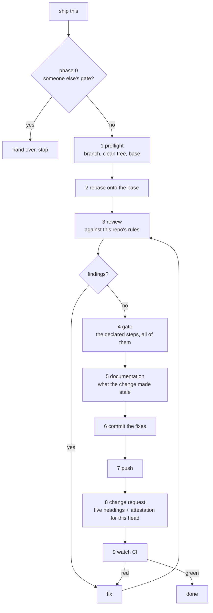

# publish

An agent skill that takes committed work through a gate — adversarial review,
then whatever tests, lint and docs commands the repository declares for itself,
then the documentation the change made stale — and only then pushes, opens the
change request, and waits for CI to go green.

A change request is a pull request on GitHub and a merge request on GitLab. The
gate is the same either way: only three phases touch the forge, through four
operations, and both adapters ship complete.

It writes an attestation into the change request body naming the commit every
step ran against, so a reader — or a machine — can tell whether the proof belongs to
the code that would actually merge. Push again and the old attestation is stale
by construction. That is what makes it proof rather than decoration.

## Install

```sh
npx skills@latest add https://github.com/LeTuR/publish \
  --skill publish --agent claude-code --global --yes
```

`--global` installs it for your user, so one install covers every repository you
publish from; `--agent` takes any agent [`skills`](https://www.npmjs.com/package/skills)
supports. Nothing goes on `PATH` and nothing is compiled — the skill is prose an
agent reads, and that is the whole deliverable.

## When an agent should load it

On "push this", "ship it", "publish", "open a PR", "get this merged" — and on
any task whose own instructions say to publish its work.

Not when the repository ships its own `publish`, `ship` or `release` skill, and
not when it already has a gate tool installed and configured in that clone.
Both of those push and open a change request too, and running two of them is how
a branch ends up with two.

## What it does



The change request body has five headings, in this order: `## Intent`,
`## What Changed`, `## Risk Assessment`, `## Testing` and `## Attestation`. The
attestation block sits under the last one, and nothing follows it.

Every phase reports one of four statuses — `passed`, `failed`, `skipped`,
`not-applicable` — and the verdict is `passed` only when every step is `passed`
or `not-applicable`. A step that could not run blocks. A red pipeline blocks. A
pipeline still running blocks. There is no fifth status to hide in.

The review phase is the product and the rest is plumbing around it: measured
against the tool this replaces, review produced the large majority of the fixes
and every other step produced a handful between them. The method it follows —
what to read first, the ten passes, the rule that every finding carries a
concrete failure scenario — is in
[`skills/publish/references/review.md`](skills/publish/references/review.md).

## The attestation marker

A consumer that wants to verify a change request greps the body for this exact
string:

```
publish-attestation/v1
```

It appears twice in every block — in the opening HTML comment and as the
`schema` field — so one grep finds the block and the JSON inside it is
machine-readable.

````markdown
<!-- publish-attestation/v1 -->
```json
{
  "schema": "publish-attestation/v1",
  "head_sha": "a1b2c3d4e5f60718293a4b5c6d7e8f9012345678",
  "base": "main",
  "base_sha": "9f8e7d6c5b4a39281706f5e4d3c2b1a098765432",
  "repository": "owner/repo",
  "attested_at": "2026-09-14T11:42:07Z",
  "gate_source": ".publish.yaml",
  "steps": [
    { "name": "review", "status": "passed", "rounds": 3, "findings": 7, "fixed": 7 },
    { "name": "lint", "status": "passed", "command": "just lint" },
    { "name": "test", "status": "passed", "command": "cargo nextest run --all" },
    { "name": "documentation", "status": "passed" },
    { "name": "ci", "status": "passed", "conclusion": "success",
      "run_url": "<the pipeline run this verdict is about>" }
  ],
  "verdict": "passed"
}
```
<!-- /publish-attestation -->
````

`head_sha` is the full 40-character commit at the tip of the pushed branch when
the gate finished. `reason` is required on any step that is `skipped` or
`failed`. The field contract is in
[`skills/publish/references/attestation.md`](skills/publish/references/attestation.md).

### Verifying one

The command is per forge - it reads the head and the body and compares them.
On GitHub:

```sh
gh pr view <number> --json headRefOid,body -q \
  '.headRefOid as $head
   | (.body | [capture("\"head_sha\"\\s*:\\s*\"(?<s>[0-9a-f]{7,40})\"").s] | first) as $attested
   | if $attested == null then "no attestation"
     elif $attested == $head then "current"
     else "stale" end'
```

On GitLab, the same question in GitLab's field names - `sha` for the head,
`description` for the body:

```sh
glab mr view <number> -R https://<host>/<group>/<project> -F json --jq \
  '.sha as $head
   | (.description | [capture("\"head_sha\"\\s*:\\s*\"(?<s>[0-9a-f]{7,40})\"").s] | first) as $attested
   | if $attested == null then "no attestation"
     elif $attested == $head then "current"
     else "stale" end'
```

`current` is the only answer that authorises anything. `stale` and
`no attestation` mean the same thing to a consumer: this change request has not
been proved. A consumer that also cares whether the gate passed reads `verdict`
from the same block and requires `passed`.

An attestation goes stale on its own, routinely: the skill opens the change
request, CI goes red, it pushes a fix, and the head is now one commit ahead of
the block. The skill rewrites the whole block for the new head every time it
pushes. Nobody hand-edits `head_sha` - an attestation you typed attests nothing.

## How a repository declares its gate

`.publish.yaml`, at the repository root:

```yaml
version: 1

forge: github
base: main

review:
  rules:
    - AGENTS.md

gate:
  - name: lint
    run: just lint
    fix: just fmt
  - name: test
    run:
      - cargo nextest run --all
      - cargo test --doc
    instructions: "The sqlite tests share one port, so a bind failure means an earlier run is still up. Stop it and re-run."

ci:
  required: true
  timeout: 30m
```

| key | required | meaning |
| --- | --- | --- |
| `version` | yes | `1`. |
| `forge` | no | `github` or `gitlab`. Default: matched from the origin remote's host. |
| `base` | no | Branch to rebase onto and target. Default: the remote's default branch. |
| `review.rules` | no | Extra files the review must read. |
| `gate` | yes | Ordered list of steps, run in the order written. |
| `gate[].name` | yes | The step's name in the attestation. Free text. |
| `gate[].run` | yes | One command, or a list run in order, from the repository root. |
| `gate[].fix` | no | Applies the mechanical fixes, once, before a re-run. |
| `gate[].instructions` | no | Text handed, as written, to whoever runs, reads or fixes the step. Anything but text is a broken declaration. |
| `ci.required` | no | Default `true`. `false` declares the repository has no CI. |
| `ci.timeout` | no | Default `30m`. |

`gate: []` declares a repository with no mechanical gate, and records
`not-applicable`. Leaving `gate` out entirely is not the same thing: the skill
falls back to `AGENTS.md` / `CLAUDE.md` / `CONTRIBUTING.md`, then a task
runner's check target, then the package manifest's scripts — labelling what it
found as `discovered:<file>` in `gate_source` — and if none of those yields
commands, the gate is `skipped` and the verdict is `blocked`.

The full contract, including what a repository whose whole gate is one script
writes, is in
[`skills/publish/references/gate.md`](skills/publish/references/gate.md).

## Layout

```
skills/publish/SKILL.md                   the skill an agent loads
skills/publish/references/gate.md         how a repository declares its gate
skills/publish/references/review.md       the review method — the product
skills/publish/references/attestation.md  the marker, the fields, staleness
skills/publish/references/forge.md        the four forge operations, per adapter
skills/publish/templates/change-request-body.md   the five-heading body to fill in
skills/publish/templates/attestation.md   the block that goes under ## Attestation
```

`npx skills add` copies `skills/publish/` and nothing else, so everything the
skill promises lives inside that directory.
[`tests/skill-self-contained.test.mjs`](tests/skill-self-contained.test.mjs) is
what keeps it that way.

## Tests

```sh
npm test
```

The skill is prose, so there is no output to assert. The suite checks the things
that rot, and the two properties everything else depends on:

| what | where |
| --- | --- |
| An attestation for an earlier head does not authorise the current one — run through the documented `jq` command itself | `tests/attestation.test.mjs` |
| A skipped step and a red pipeline cannot be reported as success, and no test in this suite opts out of running | `tests/no-silent-skip.test.mjs` |
| Every link resolves inside the installed copy, and nothing shipped is unreachable | `tests/skill-self-contained.test.mjs` |
| The documented declaration examples use the documented keys, a step's `instructions` are text or absent, and an undeclared gate blocks | `tests/gate.test.mjs` |
| The frontmatter, the phases in order with documentation between the gate and the commit, the install command, and that every forge adapter gives all four operations | `tests/skill.test.mjs` |
| The body has exactly its five headings, and the attestation sits under the last | `tests/change-request-body.test.mjs` |

## License

MIT. See [LICENSE](LICENSE).
